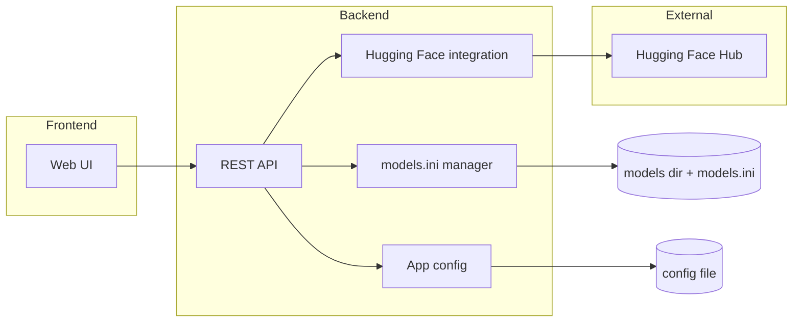

# LlamaModel, Web Application for llama.cpp

## Scope and constraints

- **Greenfield project**: Workspace is empty; no existing code to integrate.
- **models.ini format** (llama.cpp server): INI file with `LLAMA_CONFIG_VERSION = 1`, sections `[model_name]`, and parameters as `LLAMA_ARG_<NAME> = value` (e.g. `LLAMA_ARG_N_CTX`, `LLAMA_ARG_N_GPU_LAYERS`, `LLAMA_ARG_HF_REPO`). This is the format to generate and maintain.
- **Hugging Face**: Use `huggingface_hub` (HfApi, hf_hub_download, list_repo_files, ModelCard) for search, file listing, downloads, and model card content. Default model storage: `~/.cache/huggingface` (or `HF_HOME`); hub cache lives under `hub/` there.
- **Recommended parameters**: Typically appear in model README/cards (context length, n_gpu_layers, etc.). Plan: parse model card text and/or README for known patterns (e.g. "context length", "n_ctx", "n_gpu_layers") and map to `LLAMA_ARG`_* when adding entries to models.ini; allow user override.

---

## Architecture

- **Backend**: Python (FastAPI or Flask) exposing REST (or HTML + minimal JS) endpoints for search, model details, download, and models.ini read/write.
- **Frontend**: Server-rendered pages (Jinja2) plus minimal JavaScript for search, model selection, quantization choice, and download progress; “LMStudio-like” = Discover (search) → model detail (description + quantizations) → download → “My Models” list with models.ini editing.
- **Config**: Single config file (e.g. `config.yaml` or `.env`) for **port** (default `8081`) and **models directory** (default `~/.cache/huggingface`). `models.ini` path = `{models_directory}/models.ini` (or alongside hub cache; see below).
- **Models directory semantics**: Default = standard Hugging Face cache root (`~/.cache/huggingface`). `huggingface_hub` will download into `{models_directory}/hub/` when `HF_HOME` is set to that path. `models.ini` will be stored at `{models_directory}/models.ini` so one place controls both “where models are” and “where the ini lives”.

---

## Application configuration (configurable parameters)

| Parameter            | Default                         | Purpose                                                                                           |
| -------------------- | ------------------------------- | ------------------------------------------------------------------------------------------------- |
| **Port**             | `8081`                          | HTTP port for the web app.                                                                        |
| **Models directory** | `~/.cache/huggingface`          | Root for HF cache; `HF_HOME` will be set to this so downloads go under `{models_directory}/hub/`. |
| **models.ini path**  | `{models_directory}/models.ini` | Single models.ini file maintained by the app.                                                     |

Config can live in a file (e.g. `config.yaml` in project or in a user config dir) and be overridable by environment variables (e.g. `LLAMAMODEL_PORT`, `LLAMAMODEL_MODELS_DIR`).

---

## Feature breakdown

### 1. LMStudio-like model management

- **Discover**: Search/browse GGUF models (see below).
- **Model detail**: Select a model → show Hugging Face description + list of quantizations (see below).
- **Download**: Choose a quantization → download via Hugging Face API into the configured models directory (see below).
- **My Models / models.ini**: List models that have entries in models.ini (and optionally show detected GGUF files in the models dir). Allow viewing/editing default parameters per model in models.ini.

### 2. Search Hugging Face for GGUF-compatible models

- Use `huggingface_hub.HfApi().list_models()` with filter `library="gguf"` (or equivalent tag filter). Support optional text search query.
- Return list of repo IDs and basic metadata (e.g. downloads, name) for the UI. Pagination (limit/offset) recommended.

### 3. Select model → show Hugging Face page description and available quantizations

- **Description**: Fetch model card via `huggingface_hub.ModelCard.load(repo_id)` and render `card.content` or `card.text` in the app (or link to `https://huggingface.co/{repo_id}` and embed a short summary from the card).
- **Quantizations**: Call `HfApi().list_repo_files(repo_id)` and filter for filenames ending in `.gguf`. Present these as the list of available quantizations (e.g. Q4_K_M, Q5_K_S, etc. from the filename).

### 4. Download selected model + quantization (Hugging Face API)

- Use `huggingface_hub.hf_hub_download(repo_id=..., filename=<chosen .gguf>)` with `local_dir` or by setting `HF_HOME` to the configured models directory so the file lands in the standard hub layout. Optionally support “custom path” later; initially use cache under configured dir.
- Trigger download from the backend (sync or async job); if async, provide a status/poll endpoint. Stream or report progress if the library supports it (e.g. `tqdm` callback or resume support).

### 5. Recommended parameters and models.ini

- **Source of “recommended” params**: Parse model card/README (e.g. `ModelCard.load(repo_id).content`) for patterns like “context length”, “n_ctx”, “n_gpu_layers”, “ctx_size”, etc., and map to `LLAMA_ARG`_* (e.g. `LLAMA_ARG_N_CTX`, `LLAMA_ARG_N_GPU_LAYERS`). If nothing found, use safe defaults (e.g. `n_ctx=4096`, `n_gpu_layers=-1` or leave unset).
- **When to update models.ini**: After a successful download, add or update a section for that model in `models.ini`: `[model_name]` (derived from repo + filename or user choice), with at least the path to the downloaded file (or `LLAMA_ARG_HF_REPO` if llama.cpp server supports loading from HF) and the discovered/default parameters.
- **INI format**: Use Python’s `configparser` to read/write; preserve comments if desired. Ensure `LLAMA_CONFIG_VERSION = 1` at top and section names valid for llama.cpp.

### 6. Default parameters in models.ini

- Allow the user to **specify default parameters** for each model entry in models.ini (e.g. context size, n_gpu_layers, batch size). Implement via:
  - **UI**: Form to edit existing model section or to set params when adding a model after download (pre-fill from “recommended” parse, then user can edit).
  - **Backend**: Read/write models.ini with full set of supported `LLAMA_ARG`_* keys; document in UI which keys are commonly used (n_ctx, n_gpu_layers, batch, etc.).

### 7. Configurable application parameters

- **Port**: Config/key `port`, default `8081`; applied when starting the HTTP server.
- **Models location**: Config/key `models_dir`, default `~/.cache/huggingface`; used as `HF_HOME` for downloads and as the directory containing `models.ini`.
- **models.ini location**: `{models_dir}/models.ini` (fixed relative to models dir). No separate config key needed unless you later want it elsewhere.

---

## Suggested tech stack and project layout

- **Backend**: FastAPI (async, OpenAPI, easy to add progress/streaming later) or Flask (simpler).
- **Templates**: Jinja2 for server-rendered pages (Discover, model detail, My Models, settings).
- **Frontend**: Minimal JS for search-as-you-type, dropdown for quantizations, and download trigger + progress (optional).
- **Config**: PyYAML for `config.yaml` or python-dotenv for `.env`; load once at startup.
- **Dependencies**: `huggingface_hub`, `fastapi` (or `flask`), `uvicorn`, `jinja2`, `python-dotenv` or `pyyaml`, `configparser` (stdlib).

Suggested layout:

- `app/` or `src/`: main package (config load, routes, HF service, models.ini service).
- `templates/`: Jinja2 HTML.
- `static/`: CSS/JS if any.
- `config.yaml` or `.env.example`: default port and models dir.
- `requirements.txt`: pinned versions.
- `README.md`: run instructions, config options, and that models.ini is compatible with llama.cpp server.

---

## Data flow (key flows)

**Search**: User query → API calls `HfApi.list_models(library="gguf", search=query)` → return list to UI.

**Model detail**: User selects repo_id → API calls `list_repo_files(repo_id)` (filter `.gguf`) + `ModelCard.load(repo_id)` → return quantizations + description to UI.

**Download + models.ini**: User selects repo_id + filename → API runs `hf_hub_download(...)` with `HF_HOME=models_dir` → on success, parse model card for recommended params → read current models.ini, add/update section with path (or HF repo) and params → write models.ini back.

**Edit defaults**: User edits model section in UI → API updates only that section in models.ini (configparser read → modify section → write).

---

## Risks and mitigations

- **Rate limits**: Hugging Face API may rate-limit; add simple in-memory throttling or retry with backoff for list_models and downloads.
- **Large repos**: `list_repo_files` on repos with many files may be slow; cache result per repo_id for a short TTL.
- **Recommended params parsing**: Model cards are free-form; parsing may miss or misread. Prefer conservative defaults and always allow user to edit in models.ini.
- **Concurrent writes**: If multiple processes edit models.ini, use file locking (e.g. `fcntl` or a lock file) when reading/writing.

---

## Implementation order (high level)

1. Project scaffold: venv, requirements, config loading (port, models_dir), empty FastAPI/Flask app.
2. models.ini service: read/write INI, add/update section, ensure `LLAMA_CONFIG_VERSION = 1`.
3. Hugging Face service: search GGUF models, list repo files (quantizations), model card, download with `HF_HOME`.
4. Recommended-params: parse model card text → map to `LLAMA_ARG`_*; integrate into “add to models.ini” step.
5. REST (or server-rendered) endpoints: search, model detail, download (and optional status), models.ini list/get/update.
6. Frontend: Discover page (search + results), model detail page (description + quantizations + download), My Models page (list + edit models.ini defaults), Settings (port + models dir display/edit).
7. Wire download completion to “add to models.ini” with recommended params and user-editable defaults.
8. Documentation: README with config options and models.ini location.

This plan satisfies: LMStudio-like management, Hugging Face GGUF search, model page + quantizations, download via API, recommended params in models.ini, default parameters in models.ini, and configurable port and models (and models.ini) location.